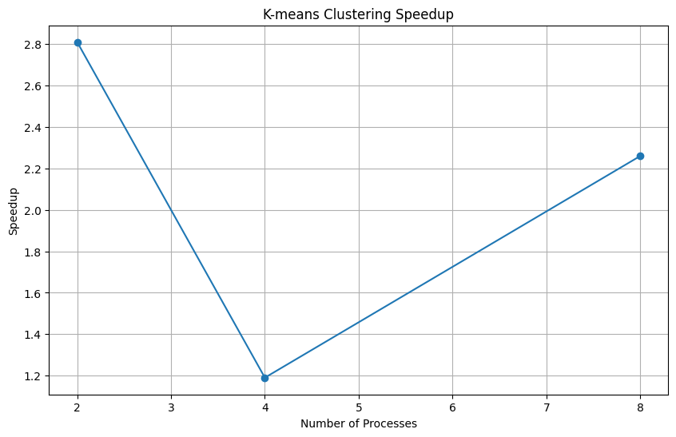

# K-means Clustering with Parallel Processing

This project implements parallel k-means clustering using Python's multiprocessing module for improved performance on multi-core systems.

## Algorithm and Parallelization Method

- Classic k-means clustering algorithm implementation
- Parallelization using Python's multiprocessing module
- Data parallelization strategy for distance calculations and cluster assignments
- Dynamic process allocation based on available CPU cores

## Instructions to Run

1. Clone and set up environment:
   ```bash
   git clone https://github.com/[username]/[repository]
   cd [repository]
   python3 -m venv .venv
   source .venv/bin/activate
   ```

2. Install dependencies:
   ```bash
   pip install numpy matplotlib scikit-learn
   ```

3. Run the benchmark:
   ```bash
   python3 src/benchmark.py
   ```

## Data Generation

- Synthetic dataset generated using `sklearn.datasets.make_blobs`
- Parameters:
  - 100,000 samples
  - 10 features per sample
  - 8 clusters
  - Random state: 42 for reproducibility
- Data is generated automatically when running `benchmark.py`

## Parallelized Components

The following parts of the k-means algorithm are parallelized:

- Distance calculations between points and centroids
- Assignment of points to nearest clusters
- Data is split into chunks and processed by multiple processes

## Project Structure

```
│   README.md
│
├───benchmarks
│       speedup.png
│
└───src
        benchmark.py
        parallelkmeans.py
        seqkmeans.py
```
    
## Performance Analysis

Speedup measured as: sequential_time / parallel_time

Number of processes tested: powers of 2 up to available CPU cores.

### Results

Example execution times:
```
Sequential time: 15.32 seconds
Parallel time (2 processes): 5.45 seconds
Parallel time (4 processes): 12.83 seconds
Parallel time (8 processes): 6.78 seconds
```

### Speedups
```
2 processes: 2.81x
4 processes: 1.19x
8 processes: 2.26x
```

### Speedup Visualization



    